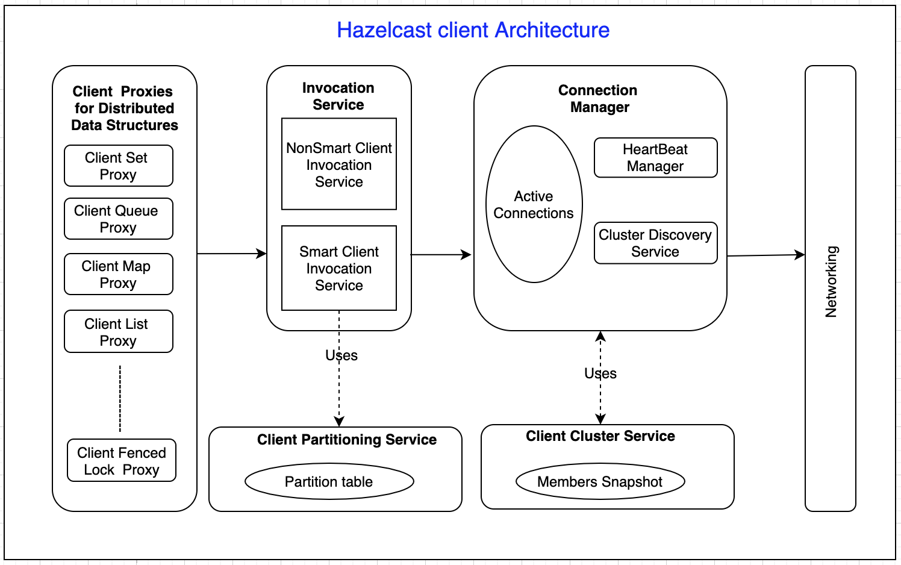

# hazelcast-java-client-anlaysis

The following is an analysis of Hazelcast Java Client Sourcode. 

Hazelcast Client is used to access and change distributed data  on the cluster. It  uses Open Binary Control Protocol to connect to the cluster members. Based on the configuration, hazelcast client may connect to all the members of cluster OR may connect only one member. 

Following is simple architecture view of the hazelcast client.

At a high level, we can view client working in 4 layers.

Client Proxies - Client Proxy objects are client side representatives of distributed data structures in cluster. For each data structure instance of hazelcast, there is a different client proxy object. Client Proxies are created lazily. Each Client Proxy provides a similar interface of the corresponding data structure. For example, ClientSetProxy will have all the operations with respect to hazelcast Set data structure. When an operation is invoked on the proxy, it converts the operation into a ClientMessage data structure, which contains the data package to be sent to cluster.

Invocation Service - Invocation Service embeds the logic to invoke the operation on the right target member(s).	 If smart routing is enabled at client, then hazelcast  client uses SmartClientInvocationService otherwise NonSmartClientInvocationService.

Smart Client Invocation Service - For data structures that lives on a partition, fetches the  partition owner's connection from Connection  Manager, and invokes the operation on that member. Partition to connection object is resolved using  PartitionTable in Client Partitioning Service.

Non-Smart Client Invocation Service - Sends all operations to one single connection. 

Connection Manager - To its core,  there are two major components and a set of active connection objects in Connection Manager

- HeartBeat Manager
- Cluster Discovery Service

HeartBeat Manager - For every active connection that Connection Manager, heartbeat manager sends a `ping` message at every `hazelcast.client.heartbeat.interval` milliseconds. When there is no packet  for `hazelcast.client.heartbeat.timeout` milliseconds from a member, closes the connection to that member.

Cluster Discovery Service - Helps discover the nodes of the cluster. 
