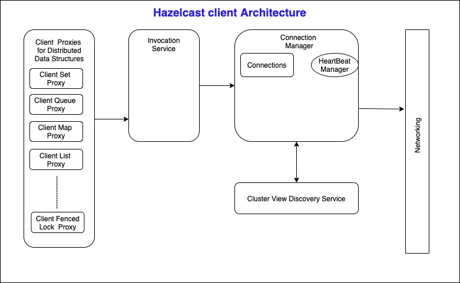

# hazelcast-client-anlaysis

The following is an analysis of Hazelcast Java Client Sourcode. 

Hazelcast Client is used to access and change distributed data  on the cluster. Based on the configuration, hazelcast may connect to all the members of cluster OR may connect only one member. Following is simple architecture view of the hazelcast client.

