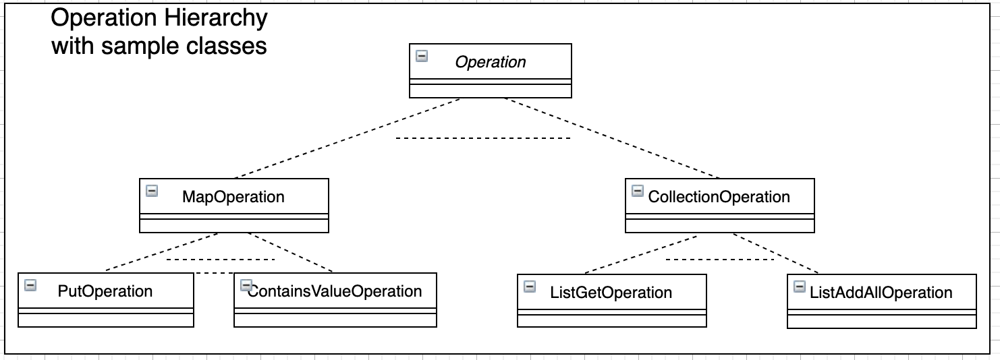
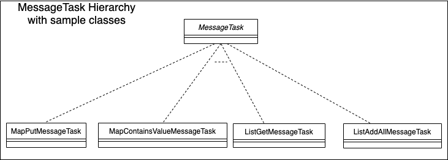
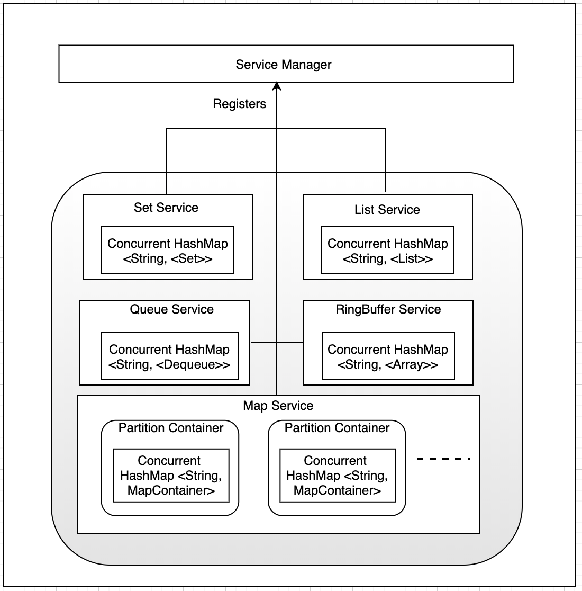
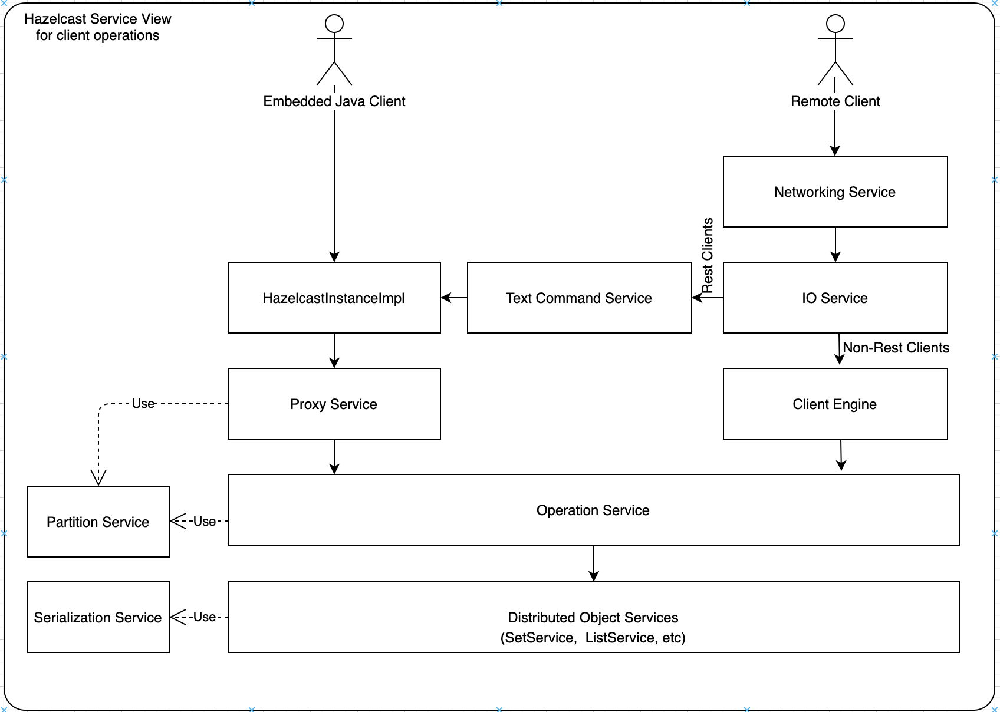
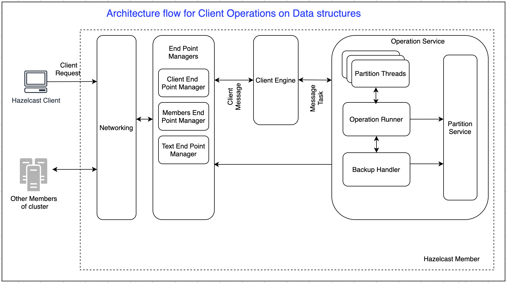

# Hazelcast Core Objects

Packet - Binary Data structure exchanged between Members.

ClientMessage - Binary Data structure exchanged between  clients and hazelcast server.

Operation - Hazelcast calls this as a Runnable. Base class for every action performed on a Distributed object. For example, put() operation on a map, get() operation on list, etc will be converted into `Operation` objects eventually on server. That `Operation` instance will have the corresponding logic to perform the action on the distributed object.

MessageTask - Interface for all the client messages that needs to be handled at hazelcast server.  For example, Map's put(key,value) operation, `ClientMessage` from client contains bytes for the Map name and the key/value pair to be added. `MapPutMessageTask` (implementation of `MessageTask`) decodes the bytes, and creates `PutOperation`(implementation of `Operation`)

# Hazelcast Distributed Object view

Hazelcast provides two types of distributed data structures. 

Partitioned Distributed data structures - Instance of the distributed data structure is divided into partitions, and each member of clusters stores a few partitions.

Non-Partitioned Distributed objects - Instance of the distributed data structure is completely stored in one member of cluster.

As shown below, each data structures storage is encapsulated in its own Service. Below view shows the object view for only Collection based distributed objects. 

Set, List, Queue, RingBuffer services holds a concurrent has map which in turns the data for their own data structures. Key of the map is the name of the distributed object, and the value is be the distributed object itself.

As the Map distributed data structure is partitioned data structure, Map Service contains a separate container for each partition. Each Partition Container contains the data for one partition. 

Replicated Map, Multivalue Map stores data similar to Map.

# Hazelcast Services View for Client Operations

When an embedded java client invokes get operations, HazelcastInstance uses the proxy service to create/destroy/fetch distributed objects and returns distributed objects to client.

These distributed objects are actually proxies to the actual data structures. For every operation that client performs on these proxies, a respective `Operation` object is created in Proxy. If the current hazelcast member is partition owner or contains replica for the distributed object that is being used, Operation is submitted to the Operation Service. If the current hazelcast member is not owner  or doesn't contain replica, Operation is sent to the remote owner of the Partition.

Operation Service executes the actual operation on the underlying distributed object service.

When an non-rest remote client invokes operations,  ClientEngine handles operations using Operation Service.

When a REST Client invokes operations, Text Command Service handles those requests, and uses HazelcastInstanceImpl for further processing.

# Hazelcast Thread View

# Hazelcast Architecture for Client Operations
 
Following is architecture view of the hazelcast server for remote-client operations.

Hazelcast client sends the operations to be performed on data structures as `ClientMessage` to the server, using Open Binary Control Protocol.

Networking layer on receiving the message from client, decodes the bytes frame into `ClientMessage` and gives it to the Client Engine (`ClientMessage` consumer).

If the type of message is to perform an operation on data structure, client engine builds the appropriate `MessageTask` for the operation received, and will invoke operation service with the `MessageTask` for executing the operation.

MessageTask is a Runnable. Operation Service proxies the `MessageTask` to Operation Executor to execute the `MessageTask` in its own Partition thread.

Each Instance of a partition thread is responsible for a set of Partitions, and for each responsible partition,  partition threads holds Operation Runner. Operation Runner  eventually prepares the `Operation` to be executed. `Operation` is executed on the local objects and using BackupHandler & PartitionService, send the operations to remote members (partition replicas).

# How Partitioning works