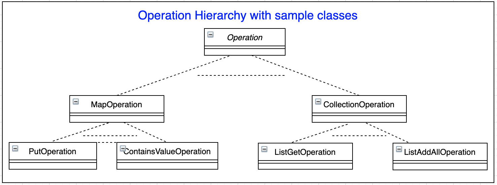
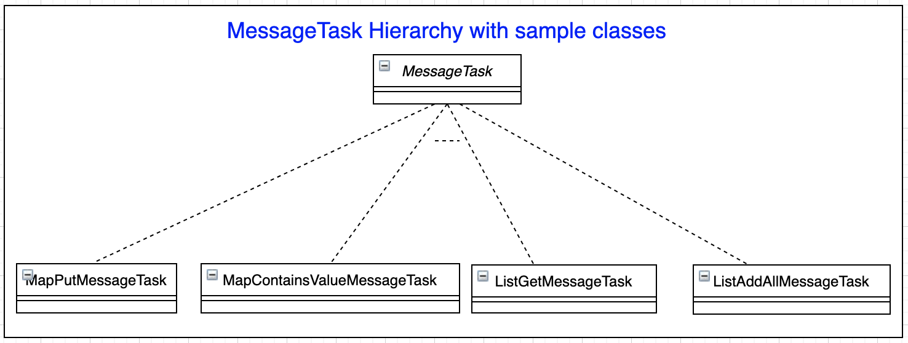
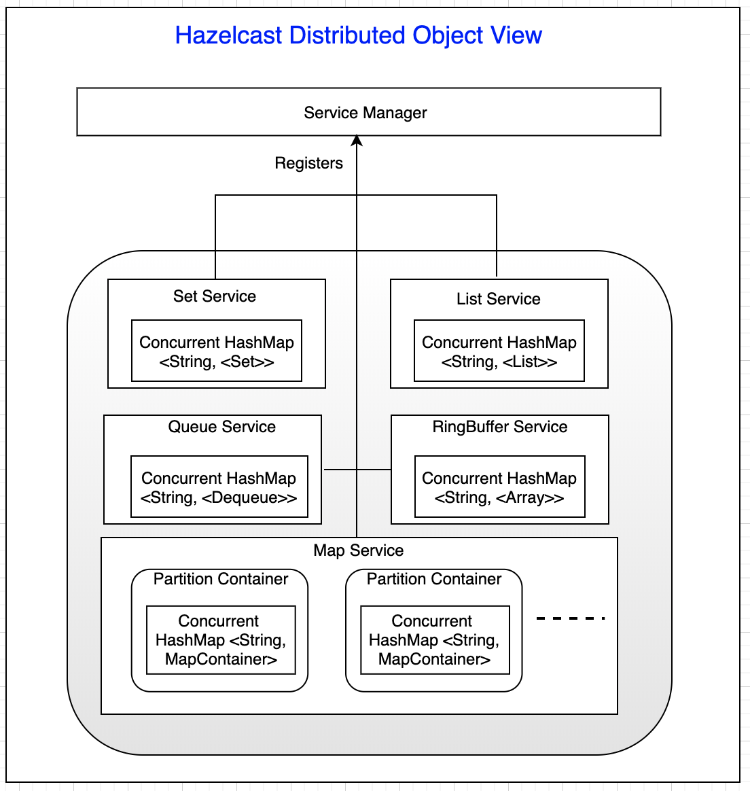
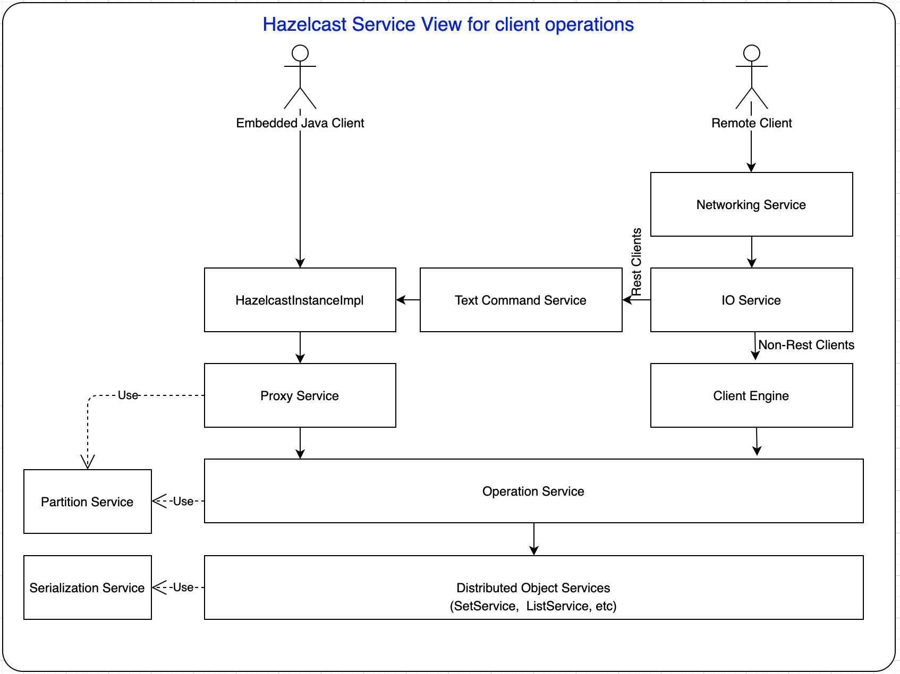
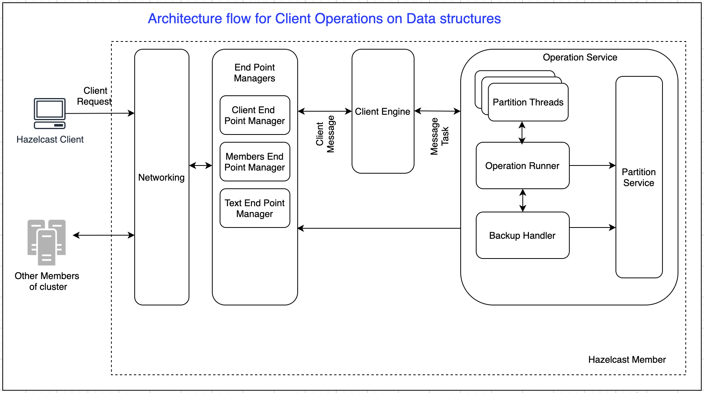

# Hazelcast Analysis for Client Operations
Hazelcast is a simple to use In-Memory Data Grid. The architecture of any such distributed system will be complex. Hazelcast users wants to understand the various aspects of the system in many instances to troubleshoot, use it more efficiently, etc.
This blog is an attempt to explain the Hazelcast system from the client usage perspective.

Hazelcast offers a embedded & client/server deployments.

In a Client/Server deployment, Client interacts with hazelcast server by sending messages embed in a object called `ClientMessage`.

## Hazelcast Core Objects
These are the core objects that are involved in every operation performed by a client in client/server deployment.

DistributedObject - Base interface for all distributed objects.

Operation - Hazelcast calls this as a Runnable. Base class for every action performed on a Distributed object. For example, put() operation on a map, get() operation on list, etc will be converted into `Operation` objects eventually on server. That `Operation` instance will have the relevant logic to perform the action on the distributed object.

ClientMessage - Binary Data structure exchanged between  clients and hazelcast server.
Hazelcast client embeds the details of the operation in ClientMessage object, and sends it to server.

MessageTask - Interface for all the client messages that needs to be handled at hazelcast server. 

Example: When a client wants to  Perform a put(k1,v1) operation on a distributed map `m`, Client will build a `ClientMessage` object which contains a data frame with bytes for the Map name `m` and the key/value (k1/v1) pair. At server on receiving  `ClientMessage` decodes into `MapPutMessageTask` (implementation of `MessageTask`), and eventually creates `PutOperation`(implementation of `Operation`) object to execute on map distributed object.

## Hazelcast Distributed Object view

Hazelcast provides two types of distributed data structures. 

Partitioned Distributed data structures - Instance of the distributed data structure is divided into partitions, and each member of clusters stores a few partitions.

Non-Partitioned Distributed objects - Instance of the distributed data structure is completely stored in one member of cluster.

As shown below, In Hazelcast each data structure is encapsulated in its own Service. Each service is a singleton object. Below view shows the object view for only Collection based distributed objects. 

Set, List, Queue, RingBuffer services holds a concurrent has map which in turns holds the data. Key of the map is the name of the distributed object, and the value is be the distributed object itself.

As the Map distributed data structure is partitioned data structure, Map Service contains a separate container for each partition. Each Partition Container contains the data for one partition. 

Replicated Map, Multivalue Map stores data similar to Map.

## Hazelcast Server Services View for Client Operations

When an embedded java client invokes get operations, HazelcastInstance returns the  proxies to the distributed objects. 

For example, fooMap in `IMap<Object, Object> fooMap = hazelcastInstance.getMap("Foo");` 
is a  proxy to the underlying distributed object.

For every operation that client performs on these proxies, a respective `Operation` object is created in Proxy. If the current hazelcast member is partition owner or contains replica for the distributed object on which the operation is being performed, Operation is submitted to the Operation Service. If the current hazelcast member is not owner  or doesn't contain replica, Operation is sent to the remote owner of the Partition.

Operation Service executes the actual operation on the underlying distributed object service.

When an non-rest remote client invokes operations,  ClientEngine handles operations using Operation Service.

When a REST Client invokes operations, Text Command Service handles those requests, and uses HazelcastInstanceImpl for further processing.

## Hazelcast Server Architecture for Client Operations
 
Following is the architecture view of the hazelcast server for remote-client operations.

Hazelcast client sends the operations to be performed on data structures as `ClientMessage` to the server, using Open Binary Control Protocol(Refers Hazelcast manual).

On receiving the message from client, Networking layer decodes the bytes frame into `ClientMessage` and gives it to the Client Engine (`ClientMessage` consumer).

If the type of message is to perform an operation on data structure, client engine builds the appropriate `MessageTask` for the operation received, and will invoke operation service with the `MessageTask` for executing the operation.

MessageTask is a Runnable. Operation Service proxies the `MessageTask` to Operation Executor for executing the `MessageTask` in its own Partition thread.

Each Instance of a partition thread is responsible for a set of Partitions. Partition Thread holds a collection of Operation Runners, each for one partition. Operation Runner  eventually prepares the `Operation` to be executed using `MessageTask`. `Operation` is executed on the local distributed objects. 

TODO -- After that BackupHandler using PartitionService, sends the operations to remote members (partition replicas).

## hazelcast-java-client-architecture

Hazelcast Client(in Client/Server deployment) is used to access and update distributed data on the cluster. It uses Open Binary Control Protocol to communicate with the cluster members. Based on the configuration, hazelcast client may connect to all the members of cluster OR may connect only one member. 

Following is simple architecture view of the hazelcast client.

At a high level, we can view client working in 4 layers.

Client Proxies - Client Proxy objects are client side representatives of distributed data structures in cluster. For each data structure instance of hazelcast, there is a different client proxy object. Client Proxies are created lazily. Each Client Proxy provides a similar interface of the corresponding data structure. For example, ClientSetProxy will have all the operations with respect to hazelcast Set data structure. When an operation is invoked on the proxy, it builds a ClientMessage data structure with the operation details to be sent to cluster.

Invocation Service - Invocation Service embeds the logic to invoke the operation on the right target member(s).	 If smart routing is enabled at client, then hazelcast  client uses SmartClientInvocationService otherwise NonSmartClientInvocationService.

Smart Client Invocation Service - For data structures that lives on a partition, fetches the  partition owner's connection from Connection  Manager, and invokes the operation on that member. TODO Partition to connection object is resolved using  PartitionTable in Client Partitioning Service.

Non-Smart Client Invocation Service - Sends all operations to one single connection. 

Connection Manager - To its core,  there are two major components and a set of active connection objects in Connection Manager

- HeartBeat Manager
- Cluster Discovery Service

HeartBeat Manager - For every active connection that Connection Manager manages, heartbeat manager sends a `ping` message at every `hazelcast.client.heartbeat.interval` milliseconds. When there is no packet  for `hazelcast.client.heartbeat.timeout` milliseconds from a member, HeartBeat Manager closes the connection to that member.

Cluster Discovery Service - Helps discover the nodes of the cluster. 
    